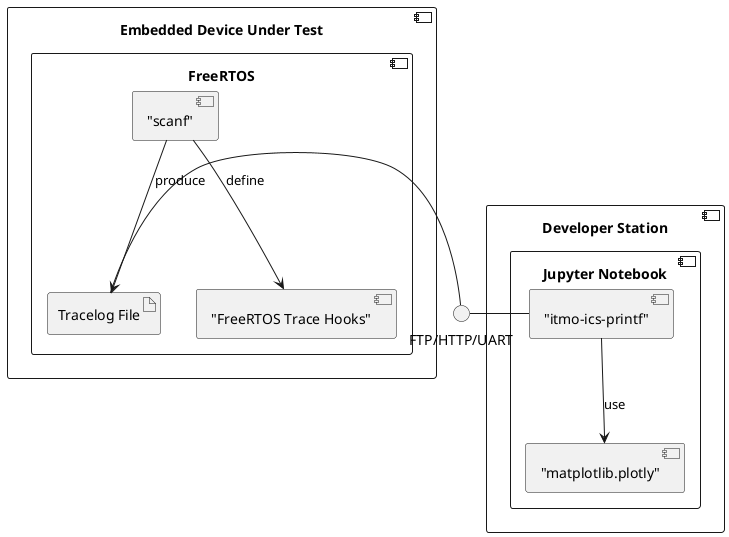

```puml
@startuml Printf/Scanf Architecture

interface "FTP/HTTP/UART"

component "Embedded Device Under Test" {
    component "FreeRTOS" {
        artifact "Tracelog File"
        "Tracelog File" - "FTP/HTTP/UART"
        ["scanf"] --> "Tracelog File" : produce
        ["scanf"] --> ["FreeRTOS Trace Hooks"] : define

    }
}

component "Developer Station" {
    component "Jupyter Notebook" {
         ["itmo-ics-printf"] --> ["matplotlib.plotly"] : use
         ["itmo-ics-printf"] - "FTP/HTTP/UART"
    }
}

@enduml
```