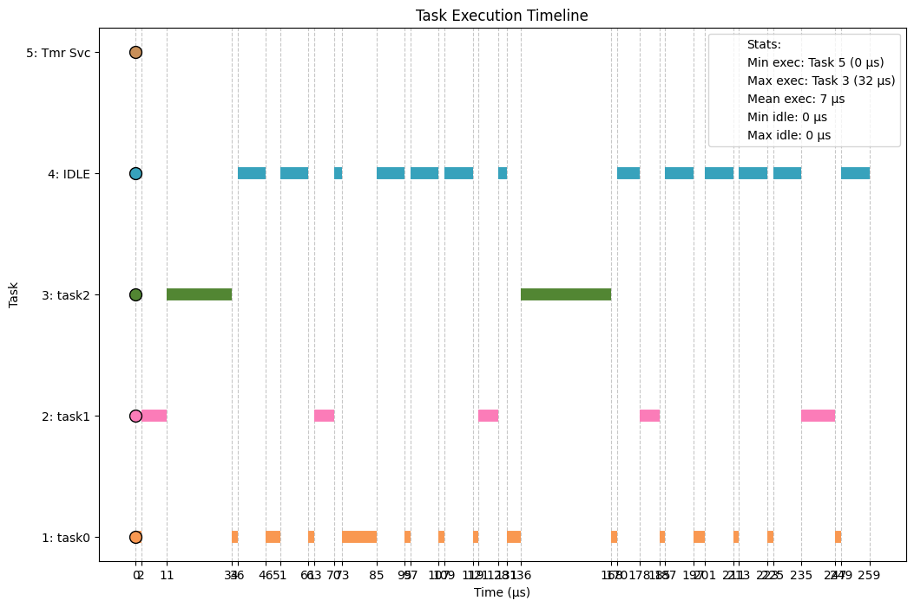
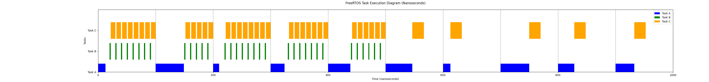

# Техническое задание

на разработку системы трассировки и анализа исполнения FreeRTOS

**Версия 1.0**

## 1. Введение

Система трассировки и анализа исполнения FreeRTOS состоит из двух компонентов: **Scanf** - для сбора трассировочных данных, и **Printf** - для их анализа и визуализации. Система предназначена для облегчения отладки и оптимизации многозадачных приложений, разработанных на базе операционной системы реального времени FreeRTOS.

## 2. Назначение разработки

### 2.1 Функциональное назначение

Система предоставляет разработчику возможность сбора информации о событиях во время работы программы на FreeRTOS и анализа этой информации с целью выявления проблем и улучшения производительности.

### 2.2 Эксплуатационное назначение

Программа сбора трассировочных данных **Scanf** предназначена для работы на тестовых стендах разработчиков и виртуальных машинах на базе FreeRTOS.

Программа анализа и визуализации данных **Printf** предназначена для использования на рабочих станциях разработчиков.

Система не предназначена для использования в производственных системах.

## 3. Требования к системе

### 3.1 Функциональные требования

#### 3.1.1 Scanf

- Сбор информации о событиях начала и завершения исполнения задач.
- Сохранение трассировочных данных в файл по запросу пользователя.
- Включение и выключение трассировки во время работы программы.
- Настройка количества собираемых записей.

#### 3.1.2 Printf

- Визуализация трассировочных данных в виде временных диаграмм.
- Отображение наименования задач для тех задач, которые были запущены с именем.
- Возможность выбора временного интервала для анализа, масштабирования диаграммы.
- Встроенный анализ метаданных задач, время исполнения, время ожидания и т.п.
- Легкая интеграция в Jupyter Notebook.
- 

Пример временной диаграммы, построенной на основе трассировочных данных в программе **Printf** (внешний вид может отличаться от финального, но информационное содержание должно быть аналогичным):

### 3.2 Нефункциональные требования

#### 3.1.1 Scanf

- Сбор информации о событиях начала и завершения исполнения задач должен осуществляться с минимальным влиянием на производительность системы. К данному требованию относится отсутствие блокирующих операций и выделение памяти во время сбора данных. Блокировка допускается только в момент записи данных в файл.

#### 3.1.2 Printf

- Программа должна сообщать о наличии повреждений в файле записи логгов от Scanf при попытке загрузки.

### 3.3 Требования к составу и параметрам технических средств

#### 3.3.1 Scanf

- FreeRTOS Kernel версии 11.1.0 с использованием порта GCC_POSIX (см. приложение "Руководство пользователя").

#### 3.3.2 Printf

- Среда Jupyter Notebook с поддержкой python 3.12 и выше и библиотек matplotlib, numpy.

### 3.4 Требования к информационной и программной совместимости

#### 3.4.1 Требования к методам и форматам реализации

- Программа **Scanf** должна представать заголовочный файл на языке C, который можно включить в проект на FreeRTOS, предоставляющий определения трассировочных хуков FreeRTOS и программный API для управления сбором данных.
- Программа **Printf** должна представлять собой файл, исполняемый в среде Jupyter Notebook, с кодом на языке Python, который обрабатывает файл с трассировочными данными, и визуализирует их в виде временных диаграмм.

#### 3.4.2 Требования к совместимости

- Изменения программ учитываются в рамках семантического версионирования.
- В рамках мажорной версии допустимы любые изменения в API и формате файлов, при условии сохранения совместимости **Scanf** и **Printf** одной версии.
- Гарантируется сохранение формата файла с трассировочными данными, создаваемого **Scanf**, в рамках минорной версии.
- Программный API **Scanf** не должен изменяться в рамках минорной версии.
- Требования к составу и параметрам технических средств могут быть изменены в мажорной версии.

## 4. Требования к документации

- Руководство пользователя c описанием установки, использования и программного API.
- Сопроводительный документ при выпуске новой версии с описанием изменений, инструкциями по обновлению и требованиями к составу и параметрам технических средств.
- Описание архитектуры и реализации системы

---

**Версия 0.1 [Устаревшее]**

## 1. Введение

Система трассировки и анализа исполнения FreeRTOS состоит из двух компонентов: **Scanf** - для сбора трассировочных данных, и **Printf** - для их анализа и визуализации. Система предназначена для облегчения отладки и оптимизации многозадачных приложений, разработанных на базе операционной системы реального времени FreeRTOS.

## 2. Назначение разработки

### 2.1 Функциональное назначение

Система предоставляет разработчику возможность сбора информации о событиях во время работы программы на FreeRTOS и анализа этой информации с целью выявления проблем и улучшения производительности.

### 2.2 Эксплуатационное назначение

Программа сбора трассировочных данных **Scanf** предназначена для работы на тестовых стендах разработчиков и виртуальных машинах на базе FreeRTOS.

Программа анализа и визуализации данных **Printf** предназначена для использования на рабочих станциях разработчиков.

Система не предназначена для использования в производственных системах.

## 3. Требования к системе

### 3.1 Функциональные требования

#### 3.1.1 Scanf

- Сбор информации о событиях начала и завершения исполнения задач.
- Сохранение трассировочных данных в файл по запросу пользователя.
- Включение и выключение трассировки во время работы программы.
- Настройка количества собираемых записей.

#### 3.1.2 Printf

- Визуализация трассировочных данных в виде временных диаграмм.
- Отображение наименования задач для тех задач, которые были запущены с именем.
- Возможность выбора временного интервала для анализа, масштабирования диаграммы.
- Возможность сохранения диаграммы в файл.

Пример временной диаграммы, построенной на основе трассировочных данных в программе **Printf** (внешний вид может отличаться от финального, но информационное содержание должно быть аналогичным):

### 3.2 Нефункциональные требования

#### 3.1.1 Scanf

- Сбор информации о событиях начала и завершения исполнения задач должен осуществляться с минимальным влиянием на производительность системы. К данному требованию относится отсутствие блокирующих операций и выделение памяти во время сбора данных. Блокировка допускается только в момент записи данных в файл.

#### 3.1.2 Printf

### 3.3 Требования к составу и параметрам технических средств

#### 3.3.1 Scanf

- FreeRTOS Kernel версии 11.1.0 с использованием порта GCC_POSIX (см. приложение "Руководство пользователя").

#### 3.3.2 Printf

- Среда Jupyter Notebook с поддержкой python 3.12 и выше и библиотек matplotlib, numpy.

### 3.4 Требования к информационной и программной совместимости

#### 3.4.1 Требования к методам и форматам реализации

- Программа **Scanf** должна представать заголовочный файл на языке C, который можно включить в проект на FreeRTOS, предоставляющий определения трассировочных хуков FreeRTOS и программный API для управления сбором данных.
- Программа **Printf** должна представлять собой файл, исполняемый в среде Jupyter Notebook, с кодом на языке Python, который обрабатывает файл с трассировочными данными, и визуализирует их в виде временных диаграмм.

#### 3.4.2 Требования к совместимости

- Изменения программ учитываются в рамках семантического версионирования.
- В рамках мажорной версии допустимы любые изменения в API и формате файлов, при условии сохранения совместимости **Scanf** и **Printf** одной версии.
- Гарантируется сохранение формата файла с трассировочными данными, создаваемого **Scanf**, в рамках минорной версии.
- Программный API **Scanf** не должен изменяться в рамках минорной версии.
- Требования к составу и параметрам технических средств могут быть изменены в мажорной версии.

## 4. Требования к документации

- Руководство пользователя c описанием установки, использования и программного API.
- Сопроводительный документ при выпуске новой версии с описанием изменений, инструкциями по обновлению и требованиями к составу и параметрам технических средств.
- Описание архитектуры и реализации системы